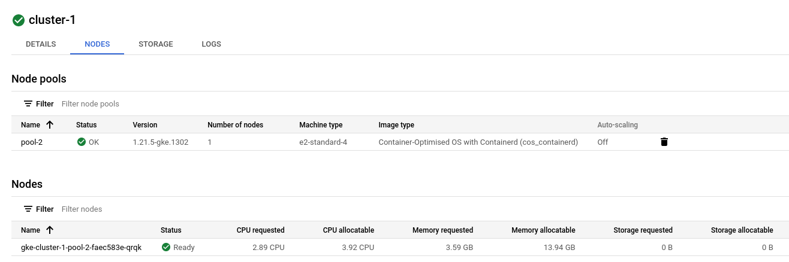
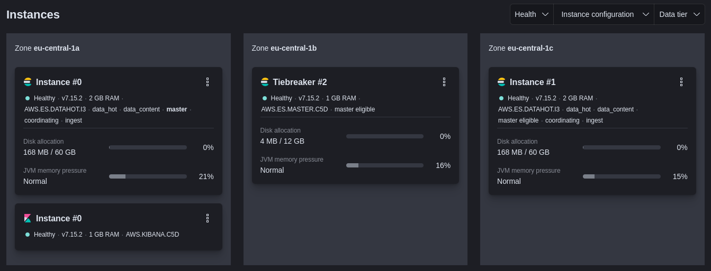
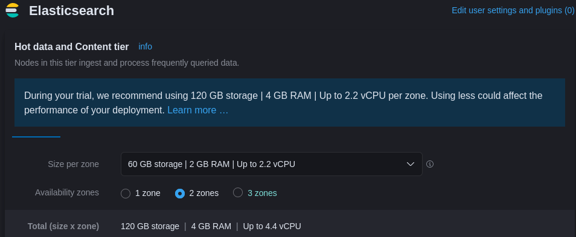
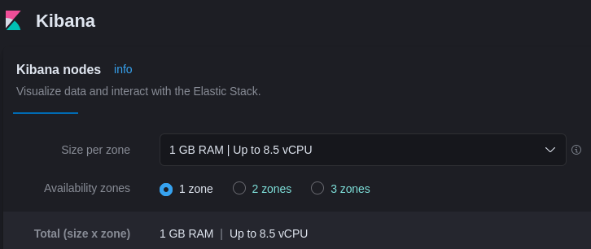

# Web Perf Monitoring

Scripts for a user journey using Canarytrace stack.

## Resources needed

- Canarytrace
- Kubernetes cluster with 1-2 nodes - at least 4 CPUs, 6 GB RAM; e.g. on Google Cloud:

- Elastic stack (Elastic, Kibana)

(Maybe even 1 GB RAM, up to 2.2 vCPU, and 30 GB disk space would be enough)

## Tooling

- Node.js on localhost
- WDIO
- Canarytrace
- K8s cluster
- `kubectl`
- provider tools like `gcloud`
- LENS or other GUI tool for K8s cluster management
- docker service on localhost
- Chrome or Chromium on localhost
- git on localhost
